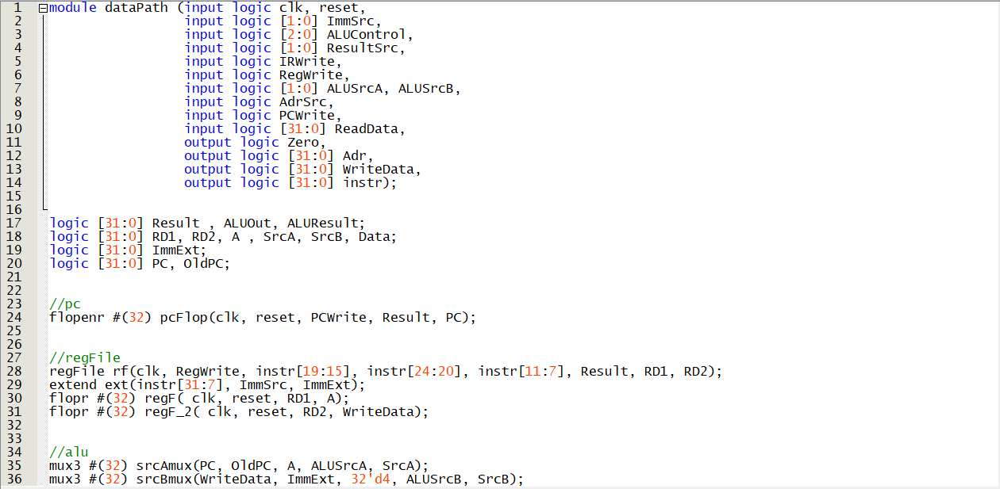
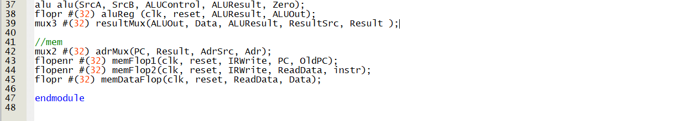

# RISCV-multi-cycle-processor
This is a multi-cycle processor designed according to the instruction set(assembly language) of RISC-V using the System Verilog HDL.
First of all, let us take a look at the code, and the schematics of the processor's different parts, and then you will see tests simulated and their results:
## The top module:

This picture represents the top module of RISC-V processor which contains a memory block, and the processor itself and the picture belwo is SystemVerilog code for
this module:

You can see the memory code in [memory.sv](memory.sv) file.
Now lets dive deeper and see the contents of the processor itself:
## The RISC-V processor module:

As you can see, it contains a Data path which should carry the data from memory to registers, from registers to ALU unit, or from registers to extend unit and etc.
And also this module contains a control unit, which interprets instructions and move on its state machine in order to valuate the control signals so that the Data path works correctly.
In oder words, control unit controls the data path.

## The Data Path module:
.png)
The Data path module contains register file, alu, extend unit, next pc register, old pc register, instruction register, data register, result multiplexer ..., all the components shown in the picture below which states an abstraction scheme of our multi-cycles RISCV processor:

These pictures are representing the basic version of the processor. The basic version does not have lui command(and some other commands) so it doesn't need to have a 4 input multiplexer. But in extended version we need to add a 4 input multiplexer to the DataPath and add some changes to ALU and other components as well, the codes that are presented in this repository are codes of extended version so you don't need to worry about it.
[flopenr](flopenr.sv), [flopr](flopr.sv), [regFile](regFile.sv), [extend unit](extend.sv), [3 input multiplexer](mux3.sv), [4 input result mux](mux4.sv), [2 input mux](mux2.sv), [alu](alu.sv).
## The control unit module:
.png)
As you can see, the controller module has a finite state machine because it is a multi-cycle processor you can see the state machine code [here](fsm.sv)
