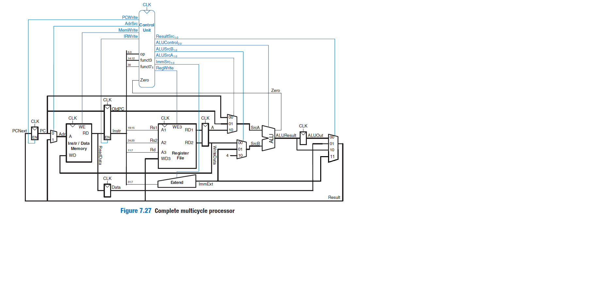

# RISCV-multi-cycle-processor
This is a multi-cycle processor designed according to the instruction set(assembly language) of RISC-V using the System Verilog HDL.
First of all, let us take a look at the code, and the schematics of the processor's different parts, and then you will see tests simulated and their results:
## The top module:

This picture represents the top module of RISC-V processor which contains a memory block, and the processor itself and the picture belwo is SystemVerilog code for
this module:

You can see the memory code in [memory.sv](memory.sv) file.
Now lets dive deeper and see the contents of the processor itself:
## The RISC-V processor module:

As you can see, it contains a Data path which should carry the data from memory to registers, from registers to ALU unit, or from registers to extend unit and etc.
And also this module contains a control unit, which interprets instructions and move on its state machine in order to valuate the control signals so that the Data path works correctly.
In oder words, control unit controls the data path.

## The Data Path module:
.png)
The Data path module contains register file, alu, extend unit, next pc register, old pc register, instruction register, data register, result multiplexer ...:

These pictures are representing the basic version of the processor. The basic version does not have lui command(and some other commands) so it doesn't need to have a 4 input multiplexer. But in extended version we need to add a 4 input multiplexer to the DataPath and add some changes to ALU and other components as well, the codes that are presented in this repository are codes of extended version so you don't need to worry about it.
[flopenr](flopenr.sv), [flopr](flopr.sv), [regFile](regFile.sv), [extend unit](extend.sv), [3 input multiplexer](mux3.sv), [4 input result mux](mux4.sv), [2 input mux](mux2.sv), [alu](alu.sv).
You can also see the extended schematic of data path :

all the components shown is in the picture below which states an abstraction scheme of our multi-cycles RISCV processor:

## The control unit module:
This is the basic version of control unit:
.png)
And the basic version of Finite State Machine:

And these are the extended one:

What happened ? Well, In order to add lui, auipc and jali instructions it was neccesary to change the FSM as stated in the picture.
But in order to add other branch instructions like bge, bne etc., it was not neccesary to change the FSM instead, we could add another module (aka branch decoder), which decodes the branch type acording to the fetched instruction. using this new module and flages that is set by the alu the next pc logic can figure out whether to branch or not to branch.
As you can see, the controller module has a finite state machine because it is a multi-cycle processor you can see the state machine code [here](fsm.sv).
This, was the description about the codes and shcematics, know it is time to see the test results:
## Test:
Each part of the processor has been tested independently(the codes and results are presented in this repo and you can investigate them).
What am I going to show you in this part is [the final test](finaltest.s) and its result.
The finaltest.s is an assembly code written in RISCV assembly language and the [finaltest.txt](finaltest.txt) contains the machine code of finaltest.s .
The [finalTb.sv](finalTb.sv) file will instansiate a RISCV-multi-cycle processor and let the processor to run and calculate the result. If the final result indecated that 4096 should be written at address 252 then the test will pass, otherwise it fails.

